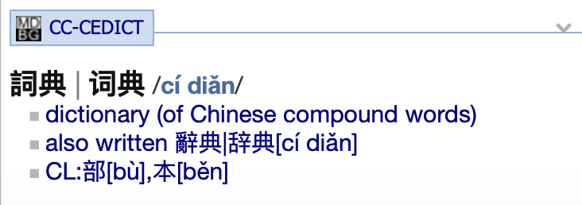

# A Java parser for the CC-CEDICT Chinese-English dictionary

## API

```java
public static class Entry {
        private String traditionalChineseWord;
        private String simplifiedChineseWord;
        private String mandarinPinyin;
        private List<String> englishDefinitions;
        ...
}
```

`Entry getEntry(String line)` Get the entry object from a line of CC-CEDICT format file.

`String getHtml(Entry entry)` CC-CEDICT entry object to HTML.

`String[] convertPinyin(String pinyin)` Converts the CC-CEDICT pinyin to accented pinyin.

### How to use

```java
com.github.barrer.cccedict.CCCEDictParserTest
```

## Java Version

JDK 1.5 and above

## Build

`mvn clean compile package -Dmaven.test.skip=true`

## MDict

### Create MDict source files

`java -jar cccedict.jar ~/Downloads/cedict_ts.u8`

### GoldenDict screenshot


